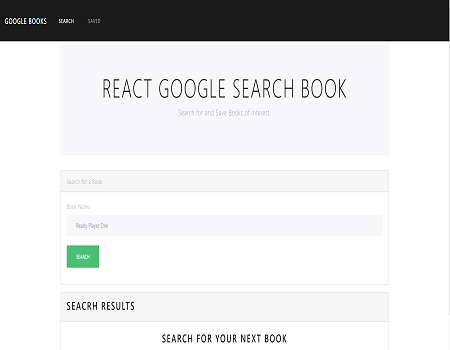

# React Reading List App

A MERN Stack Google Books Search with Google Books API

	

### Overview

* Search Page -  User can search for books via the Google Books API and render them here. User has the option to "View" a book, bringing them to the book on Google Books, or "Save" a book, saving it to the Mongo database.

* Saved Page - Save page renders all books saved to the Mongo database. User has an option to "View" the book, bringing them to the book on Google Books, or "Delete" a book, removing it from the Mongo database.

### Technologies Used

* React - For Front End

* Nodejs & Express - For Back End

* Mongodb - For Database

### Deployed Link
[`React-Google-Book](https://radiant-beyond-81258.herokuapp.com/)
